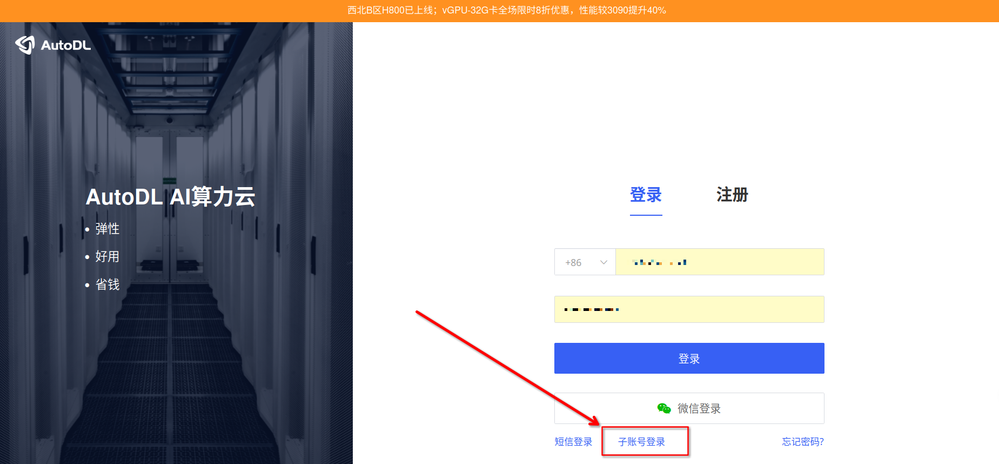
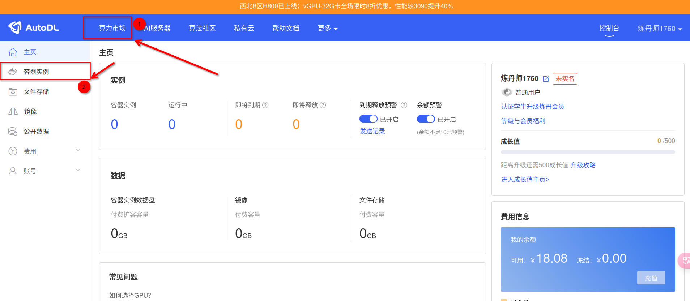
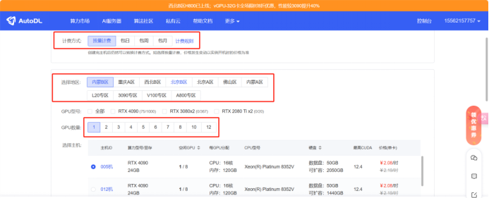
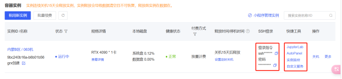

# AutoDL 租用

## 账号注册
!!!first of all，不要着急去注册自己的账号。目前组内租用 AutoDL 服务器是使用子账号的方式，使用自己注册的账号是无法使用组内充值的金额的。

唯一需要做的事情，就是联系江文博士开通子账号，并且保存好自己的账号密码。

进入 [AutoDL官网](https://www.autodl.com/)

好了，现在点击**子账号登录**

## 服务器租用
> 此部分主要参考 AutoDL [官方文档](https://www.autodl.com/docs/)，自己看文档是个好习惯，毕竟这里可能会年久失修吧
> Tips:
> 1. 如果需要使用共享数据储存、挂载和系统快照，需要注意选择所选实例的地区
> 2. 理论上按日按月租用会相对按时计费更划算一些

点击容器实例，租用新实例。

选择计费方式、地区、GPU的数量。**选择 GPU 的时候需要特别关注一下当前实例支持的 CUDA 版本**。

选择环境镜像的配置，**推荐直接选用只有 Miniconda 的环境**。

选择好后，点击立即创建

## 正常开机和无卡开机
> tips：
> 1. 开机前建议设置好自动关机时间，避免超时运行导致扣费

按照需求选择正常开机和无卡开机模式，如果仅需要安装环境（存疑）或者传输数据，则使用无卡开机即可。

开启的机器支持 ssh 连接 或者 jupyternote。

需要长时间运行时，考虑 ssh 中使用 screen 或者类似工具，确保进程能够在后台持续运行。使用 jupyter 或者 ssh 前台运行可能因为浏览器策略或者连接中断导致任务被结束。

ssh 终端推荐使用 [Tabby](https://tabby.sh/)，调试代码时推荐使用 VSCode + Jupyter 插件。

**在网页端或者 VSCode Jupyter 中使用时，注意切换 Kernel。**

## 共享数据储存、挂载和系统快照
> 注意存储地区

### 本地储存
可挂载至同一地区的不同实例中，挂载点为 `/root/autodl-fs`

缺点主要是磁盘 IO 较低，适合储存数据集、配置文件等，方便在多实例之间同步数据。

具体限制参考[AutoDL-文件储存](https://www.autodl.com/docs/fs/)

### 系统快照/镜像
支持在实例关机后保存当前系统镜像，如果对当前系统环境有复用需求的可以使用，在租用新实例的时候可以挂载自定义的镜像，**注意 CUDA 等版本冲突**。

具体限制参考[AutoDL-镜像](https://www.autodl.com/docs/image/)